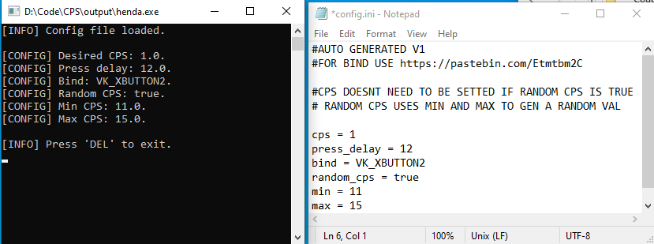

# Autoclicker
Aimed to be as simple as possible and portable (No need to install other things)    
Just open and use (simple as that)  
> Very simple to use configuration system  

# Source 
C++ lightweight autoclicker coded by me.  
Reused some code of mine such as thread worker.

